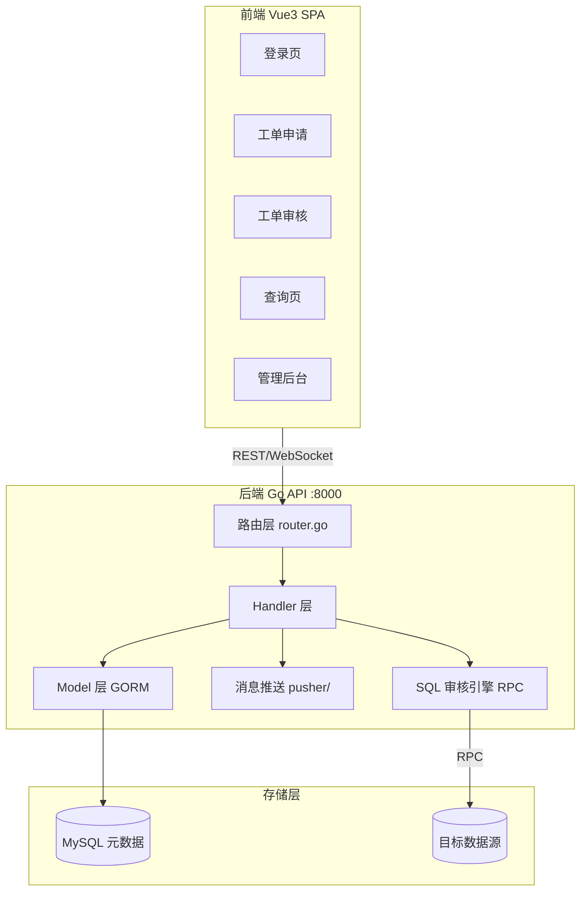
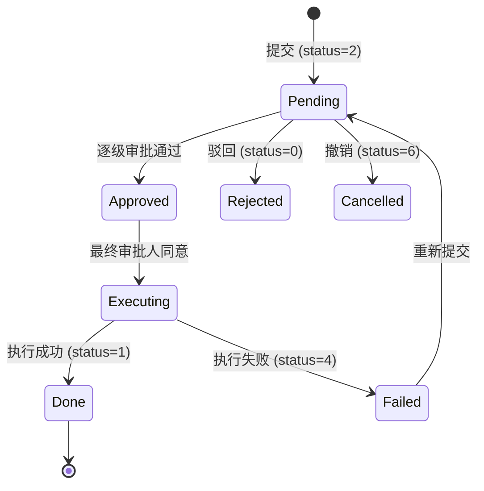
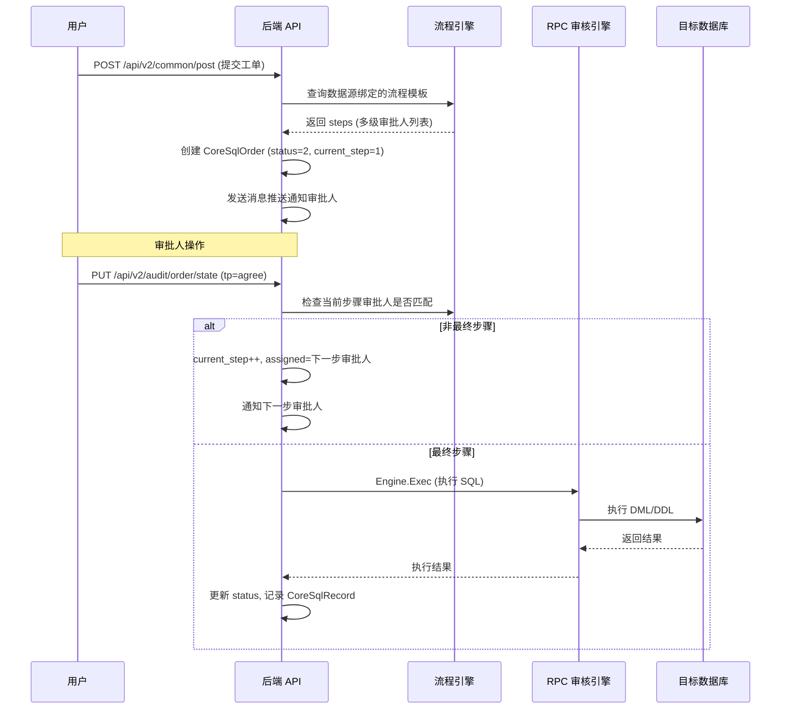

# 00 - 项目现状分析

## 一、整体架构



## 二、后端架构

### 2.1 技术选型

- **语言**: Go 1.22 (`go.mod` 中 toolchain `go1.22.2`)
- **HTTP 框架**: [yee](https://github.com/cookieY/yee) + 中间件 (CORS, JWT, Logger, Recovery, Gzip)
- **ORM**: GORM v2 + MySQL Driver
- **查询引擎**: `cookieY/sqlx` 直连目标库执行 SQL
- **RPC**: 外部 SQL 审核引擎通过 `net/rpc` 通信 (配置项 `General.RpcAddr`)
- **认证**: JWT (HS256, 8h 过期), LDAP (`go-ldap`), OIDC
- **消息**: 邮件 (`gomail`), 钉钉 Webhook
- **定时任务**: `robfig/cron`
- **AI**: OpenAI 客户端 (`sashabaranov/go-openai`)
- **配置**: TOML 文件 (`BurntSushi/toml`) + 环境变量覆盖

### 2.2 路由结构

```
公开路由:
  POST /login              - 本地登录
  POST /register           - 注册
  POST /ldap               - LDAP 登录
  GET  /oidc/_token-login  - OIDC 回调
  GET  /oidc/state         - OIDC 配置
  GET  /fetch              - 前端开关
  GET  /lang               - 语言

JWT 保护路由 (/api/v2):
  POST /chat               - AI 对话
  /common/:tp              - 个人工单 (GET list / POST post,edit)
  /dash/:tp                - Dashboard
  /fetch/:tp               - Fetch 数据
  /query/:tp               - 查询

  /audit/order/:tp         - 工单审批 (GET list / PUT state,kill,scheduled)
  /audit/query/:tp         - 查询审批

  /record (需 Recorder 权限)
    GET /axis              - 统计图
    GET /list              - 记录列表

  /manage (需 Admin 权限)
    /db                    - 数据源管理
    /user                  - 用户管理
    /tpl                   - 流程模板
    /policy                - 权限组
    /setting               - 全局设置
    /roles/:tp             - 审核规则
    /task                  - 自动化任务
```

### 2.3 Handler 层模块

| 模块 | 路径 | 职责 |
|------|------|------|
| login | `src/handler/login/` | 本地/LDAP/OIDC 登录, 注册 |
| personal | `src/handler/personal/` | 用户提交工单, 查询执行, 个人信息编辑 |
| order/audit | `src/handler/order/audit/` | 工单审批 (agree/reject/undo), 延时执行 |
| order/query | `src/handler/order/query/` | 查询工单审批 |
| order/osc | `src/handler/order/osc/` | Online Schema Change 控制 |
| manage/db | `src/handler/manage/db/` | 数据源 CRUD, 连接测试 |
| manage/flow | `src/handler/manage/flow/` | 审批流程模板管理 |
| manage/user | `src/handler/manage/user/` | 用户 CRUD |
| manage/group | `src/handler/manage/group/` | 权限组管理 |
| manage/roles | `src/handler/manage/roles/` | 审核规则集管理 |
| manage/settings | `src/handler/manage/settings/` | 全局配置 (LDAP/邮件/钉钉/AI) |
| manage/autoTask | `src/handler/manage/autoTask/` | 自动化 DML 任务 |
| fetch | `src/handler/fetch/` | AI 对话, 数据获取 |

## 三、前端架构

### 3.1 技术选型

- **框架**: Vue 3.2 + TypeScript
- **构建**: Vite 3 (base: `/front/`)
- **UI**: Ant Design Vue + Monaco Editor + G2 图表
- **状态**: Vuex 4 + vuex-persistedstate
- **路由**: vue-router 4 (Hash History)
- **国际化**: vue-i18n (中/英)
- **HTTP**: axios

### 3.2 页面路由结构

```
/login                    - 登录
/home/workplace           - 工作台
/home/profile             - 个人设置
/advisor/ai               - AI 分析
/apply/list               - 工单申请列表
/apply/order              - 工单填写
/apply/query              - 查询
/server/order/audit       - 工单审核
/server/query/list        - 查询审核
/server/order/:tp/list    - 工单列表
/comptroller/order/:tp    - 审计记录
/manager/user             - 用户管理
/manager/db               - 数据源管理
/manager/flow             - 流程管理
/manager/policy           - 权限组
/manager/rules            - 审核规则
/manager/autotask         - 自动化任务
/manager/board            - 公告
/manager/setting          - 设置
```

### 3.3 API 层

前端 API 封装位于 `gemini-next-next/src/apis/`:

| 文件 | 对应后端 |
|------|---------|
| `loginApi.ts` | 登录/注册 |
| `orderPostApis.ts` | 工单提交 |
| `listAppApis.ts` | 工单列表 |
| `query.ts` | 查询操作 |
| `db.ts` | 数据源管理 |
| `flow.ts` | 流程模板 |
| `user.ts` | 用户管理 |
| `rules.ts` | 审核规则 |
| `setting.ts` | 设置 |
| `policy.ts` | 权限组 |
| `autotask.ts` | 自动化任务 |

## 四、核心数据模型

### 4.1 表结构总览

| 模型 | 表名 | 核心字段 | 用途 |
|------|------|---------|------|
| `CoreAccount` | `core_accounts` | username, password, email, is_recorder | 用户账户 |
| `CoreSqlOrder` | `core_sql_orders` | work_id, source_id, status, assigned, current_step, sql | SQL 工单 |
| `CoreQueryOrder` | `core_query_orders` | work_id, source_id, status, assigned | 查询工单 |
| `CoreDataSource` | `core_data_sources` | source_id, ip, port, flow_id, rule_id, is_query | 数据源配置 |
| `CoreWorkflowTpl` | `core_workflow_tpls` | source, steps (JSON) | 审批流程模板 |
| `CoreWorkflowDetail` | `core_workflow_details` | work_id, username, action, time | 审批流转明细 |
| `CoreRollback` | `core_rollbacks` | work_id, sql | 回滚 SQL |
| `CoreSqlRecord` | `core_sql_records` | work_id, sql, state, affect_row | SQL 执行记录 |
| `CoreRoleGroup` | `core_role_groups` | name, permissions (JSON), group_id | 权限组 |
| `CoreGrained` | `core_graineds` | username, group (JSON) | 用户-权限组关联 |
| `CoreRules` | `core_rules` | desc, audit_role (JSON) | 审核规则集 |
| `CoreAutoTask` | `core_auto_tasks` | name, source_id, database, table, tp, status | 自动化 DML 任务 |
| `CoreGlobalConfiguration` | `core_global_configurations` | ldap, message, other, audit_role, ai (JSON) | 全局配置 |
| `CoreOrderComment` | `core_order_comments` | work_id, username, content | 工单评论 |
| `CoreTotalTickets` | `core_total_tickets` | date, total_order, total_query | 每日统计 |

### 4.2 工单状态机



### 4.3 审批流程



## 五、消息推送现状

### 5.1 架构

```
pusher/
├── types.go    - Msg/OrderTPL 结构体, 状态枚举
├── pusher.go   - 邮件发送 (gomail), 消息构建, Push() 分发
└── ding.go     - 钉钉 Webhook (markdown 模板, HMAC 签名)
```

### 5.2 推送流程

1. `NewMessagePusher(workId)` 创建消息构建器
2. `.Order()` / `.Query()` 加载工单信息和收件人
3. `.OrderBuild(status)` 根据状态生成邮件模板 + 钉钉模板
4. `.Push()` 遍历收件人发送邮件 + 调用钉钉 Webhook

### 5.3 局限

- 仅支持邮件 + 钉钉两个渠道
- 模板硬编码为 Go 字符串常量，不可配置
- 钉钉使用 markdown 格式，不支持卡片交互

## 六、认证现状

- **本地登录**: 用户名+密码, Django 风格加盐哈希校验, JWT 返回
- **LDAP**: 绑定验证后自动创建本地账户
- **OIDC**: Authorization Code 流程, 自动创建本地账户
- **JWT**: HS256, 8h 过期, Claims 包含 `name`, `real_name`, `is_record`
- **MFA**: `loginForm` 中已预留 `MFACode` 字段但未实现

## 七、痛点总结

| 痛点 | 现状 | 影响 |
|------|------|------|
| 单数据源提交 | `CoreSqlOrder.SourceId` 为单值 | 多环境相同 SQL 需重复提交 |
| 逐个审批 | `AuditOrderState` 单工单处理 | 批量变更场景效率低 |
| 推送渠道少 | 仅邮件+钉钉 | 无法覆盖企业微信/飞书用户 |
| 模板不可配 | 硬编码 HTML/Markdown | 无法自定义通知内容 |
| 外键规则不完整 | 仅 bool 开关 | 缺少索引检查/级联控制/命名规范 |
| 表名前缀未实现 | 字段已定义但未使用 | 无法强制表命名规范 |
| 回滚未实现 | 模型和开关已存在 | 无法基于主键生成回滚语句 |
| 无 MFA | 字段已预留 | 安全性不足 |
| 无移动端 | 仅 PC Web | 审批人无法随时处理 |
| 无工单复制 | - | 多环境流转需手动重建 |
