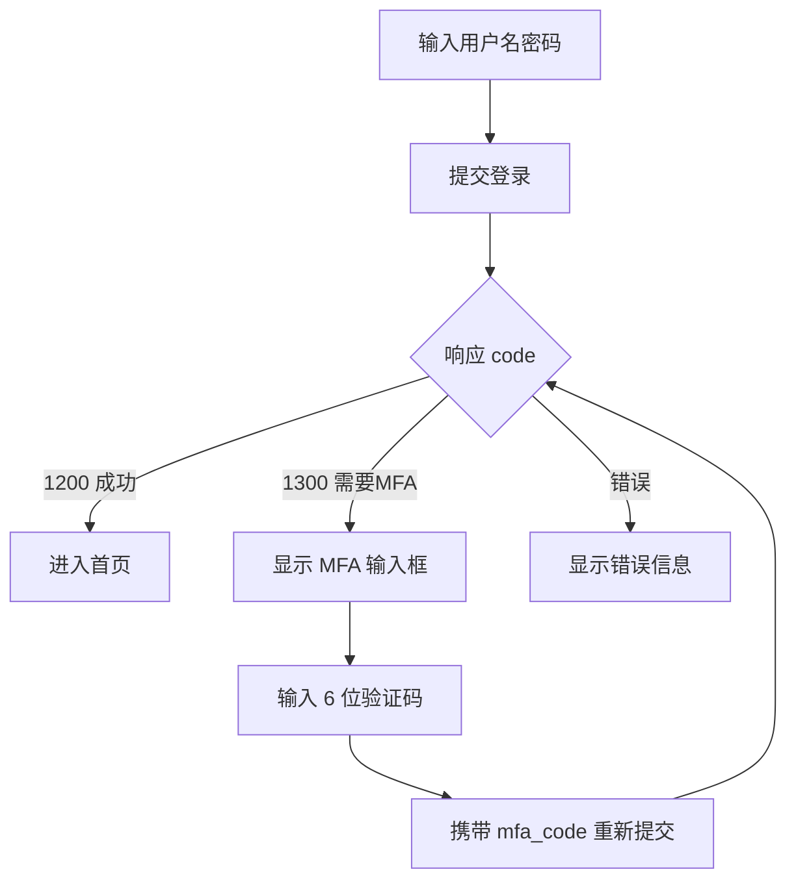

# 02 - MFA 登录认证

> **优先级**: P0 | **预估工期**: 3-5 天 | **依赖**: 无

## 一、需求背景

当前系统支持本地密码、LDAP、OIDC 三种认证方式，但缺少多因子认证 (MFA)。`loginForm` 中已预留 `MFACode` 字段但未实现。对于操作敏感数据库的审核平台，MFA 是安全合规的基本要求。

## 二、现状分析

### 2.1 登录流程

```go
// login.go - loginForm 已预留 MFACode
type loginForm struct {
    Username string `json:"username"`
    Password string `json:"password"`
    MFACode  string `json:"mfa_code"`
}
```

**本地登录** (`UserGeneralLogin`):
1. 查询用户 -> `DjangoCheckPassword` 校验密码 -> 生成 JWT

**LDAP 登录** (`UserLdapLogin`):
1. LDAP 绑定验证 -> 自动创建/更新本地账户 -> 生成 JWT

**OIDC 登录** (`OidcLogin`):
1. Authorization Code 换 Token -> 获取用户信息 -> 自动创建本地账户 -> 重定向带 JWT

### 2.2 JWT 结构

```go
// Claims: name, real_name, is_record, exp (8h)
```

## 三、技术方案

### 3.1 方案选型

采用 **TOTP (Time-based One-Time Password)** 算法，兼容 Google Authenticator、Microsoft Authenticator、1Password 等主流客户端。

**Go 依赖**: `github.com/pquerna/otp`

### 3.2 后端改动

#### 3.2.1 数据模型扩展

**文件**: `Yearning-next/src/model/modal.go`

`CoreAccount` 新增字段:

```go
type CoreAccount struct {
    // ... 现有字段
    MFASecret  string `gorm:"type:varchar(100);default:''" json:"-"`
    MFAEnabled bool   `gorm:"type:tinyint(1);default:0" json:"mfa_enabled"`
}
```

- `MFASecret`: TOTP 密钥，`json:"-"` 确保不会返回给前端
- `MFAEnabled`: 是否已启用 MFA

#### 3.2.2 MFA 管理 API

**新增文件**: `Yearning-next/src/handler/personal/mfa.go`

```go
// POST /api/v2/common/mfa/setup - 生成 TOTP 配置
func MFASetup(c yee.Context) error {
    user := new(factory.Token).JwtParse(c)
    // 1. 生成 TOTP Key
    key, _ := totp.Generate(totp.GenerateOpts{
        Issuer:      "Yearning",
        AccountName: user.Username,
    })
    // 2. 保存 secret 到数据库 (尚未启用)
    model.DB().Model(&model.CoreAccount{}).
        Where("username = ?", user.Username).
        Update("mfa_secret", key.Secret())
    // 3. 生成 QR Code (base64)
    img, _ := key.Image(200, 200)
    // 编码为 base64 返回
    return c.JSON(200, common.SuccessPayload(map[string]interface{}{
        "secret":  key.Secret(),
        "qr_code": base64QR,
    }))
}

// POST /api/v2/common/mfa/verify - 验证并启用 MFA
func MFAVerify(c yee.Context) error {
    // 接收 code, 用 totp.Validate() 校验
    // 成功后 update mfa_enabled = true
}

// POST /api/v2/common/mfa/disable - 关闭 MFA
func MFADisable(c yee.Context) error {
    // 接收当前 TOTP code 验证后关闭
}
```

#### 3.2.3 修改登录流程

**文件**: `Yearning-next/src/handler/login/login.go`

```go
func UserGeneralLogin(c yee.Context) (err error) {
    u := new(loginForm)
    c.Bind(u)

    var account model.CoreAccount
    model.DB().Where("username = ?", u.Username).First(&account)

    if factory.DjangoCheckPassword(&account, u.Password) {
        // ---- MFA 检查 (新增) ----
        if account.MFAEnabled {
            if u.MFACode == "" {
                // 密码正确但未提供 MFA code, 提示前端
                return c.JSON(200, map[string]interface{}{
                    "code": 1300,  // 自定义状态码
                    "payload": map[string]interface{}{
                        "require_mfa": true,
                    },
                })
            }
            if !totp.Validate(u.MFACode, account.MFASecret) {
                return c.JSON(200, ERR("MFA 验证码错误"))
            }
        }
        // ---- MFA 检查结束 ----

        token, _ := factory.JwtAuth(...)
        return c.JSON(200, SuccessPayload(dataStore))
    }
}
```

对 `UserLdapLogin` 做相同改造: LDAP 验证通过后检查本地账户的 MFA 状态。

OIDC 登录: 由于 OIDC 回调是重定向流程，若用户启用了 MFA，重定向到 `/#/login?oidcLogin=1&require_mfa=1`，前端弹出 MFA 输入框后再调用一个新接口完成验证。

#### 3.2.4 路由注册

**文件**: `Yearning-next/src/router/router.go`

```go
// 在 personal Restful 组之外新增
r.POST("/common/mfa/setup", personal.MFASetup)
r.POST("/common/mfa/verify", personal.MFAVerify)
r.POST("/common/mfa/disable", personal.MFADisable)
```

#### 3.2.5 管理员强制 MFA

在用户管理 API 中新增:

```go
// PUT /api/v2/manage/user - 新增 force_mfa 字段
// 管理员可设置用户必须启用 MFA，下次登录时强制绑定
```

### 3.3 前端改动

#### 3.3.1 登录页

**文件**: `gemini-next-next/src/views/login/login.vue`

交互流程:



改动要点:
- 新增 `mfaRequired` 响应式状态
- 当 `require_mfa = true` 时，显示 MFA 验证码输入框 (6 位数字)
- 用户输入后携带 `mfa_code` 重新发起登录请求

#### 3.3.2 个人设置页

**文件**: `gemini-next-next/src/views/home/profile.vue`

新增 "安全设置" 区块:

```
┌──────────────────────────────────────┐
│  多因子认证 (MFA)                      │
│                                      │
│  状态: ● 未启用                        │
│                                      │
│  [启用 MFA]                           │
│                                      │
│  点击后:                               │
│  ┌──────────────────────────────┐    │
│  │  请使用 Authenticator 扫描:    │    │
│  │  ┌──────────┐               │    │
│  │  │ [QR Code]│               │    │
│  │  └──────────┘               │    │
│  │  或手动输入密钥: JBSWY3DPEH.. │    │
│  │                              │    │
│  │  验证码: [______]            │    │
│  │  [确认绑定]                   │    │
│  └──────────────────────────────┘    │
└──────────────────────────────────────┘
```

#### 3.3.3 新增 API

**文件**: `gemini-next-next/src/apis/user.ts`

```typescript
export const MFASetup = () => axios.post('/api/v2/common/mfa/setup')
export const MFAVerify = (params: { code: string }) =>
    axios.post('/api/v2/common/mfa/verify', params)
export const MFADisable = (params: { code: string }) =>
    axios.post('/api/v2/common/mfa/disable', params)
```

## 四、数据库迁移

```sql
ALTER TABLE core_accounts ADD COLUMN mfa_secret VARCHAR(100) DEFAULT '';
ALTER TABLE core_accounts ADD COLUMN mfa_enabled TINYINT(1) DEFAULT 0;
```

## 五、接口定义

### POST /api/v2/common/mfa/setup

**请求**: 无参数 (从 JWT 获取用户)

**响应**:
```json
{
    "code": 1200,
    "payload": {
        "secret": "JBSWY3DPEHPK3PXP",
        "qr_code": "data:image/png;base64,iVBOR..."
    }
}
```

### POST /api/v2/common/mfa/verify

**请求**:
```json
{ "code": "123456" }
```

**响应**:
```json
{ "code": 1200, "text": "MFA 已启用" }
```

### POST /api/v2/common/mfa/disable

**请求**:
```json
{ "code": "123456" }
```

**响应**:
```json
{ "code": 1200, "text": "MFA 已关闭" }
```

### POST /login (修改)

**请求** (MFA 场景):
```json
{
    "username": "zhangsan",
    "password": "xxx",
    "mfa_code": "123456"
}
```

**响应** (需要 MFA):
```json
{
    "code": 1300,
    "payload": { "require_mfa": true }
}
```

## 六、安全考量

1. `MFASecret` 使用 `json:"-"` 标签，API 响应中不会泄露
2. `MFASetup` 接口仅在绑定过程中返回一次 secret，绑定完成后不再可获取
3. TOTP 验证窗口使用默认 30 秒，允许前后各 1 个窗口容错
4. 管理员可强制要求特定用户启用 MFA
5. 建议后续增加备用恢复码机制，防止用户丢失 Authenticator 设备

## 七、测试要点

1. 未启用 MFA 的用户正常登录不受影响
2. 启用 MFA 后，不提供 code 返回 `require_mfa: true`
3. 提供正确 code 可正常登录
4. 提供错误 code 返回错误信息
5. MFA 绑定流程: setup -> 扫码 -> verify -> 启用
6. MFA 解绑: 提供正确 code -> 关闭
7. LDAP 用户的 MFA 流程
8. 时钟偏移场景下的 TOTP 容错验证
