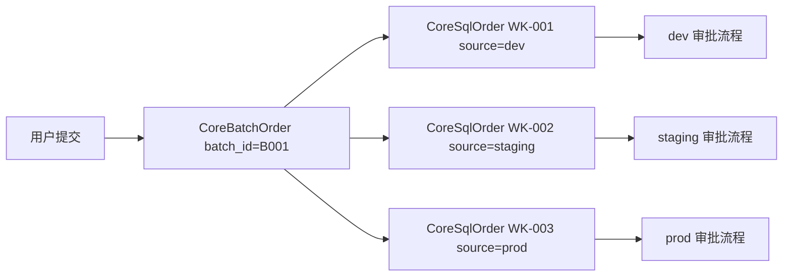

# 03 - 多数据源批量同步

> **优先级**: P1 | **预估工期**: 5-7 天 | **依赖**: 无

## 一、需求背景

当前工单提交时 `CoreSqlOrder.SourceId` 为单值，同一条 SQL 如需在多个数据源执行（如 dev/staging/prod 同时变更表结构），用户需要重复创建多个工单。需要支持一次选择多个数据源，系统自动拆分为多个关联工单。

## 二、现状分析

### 2.1 当前工单提交

```go
// personal/post.go - sqlOrderPost
// 接收单个 CoreSqlOrder, 其中 SourceId 为单个值
func sqlOrderPost(c yee.Context) error {
    order := new(model.CoreSqlOrder)
    c.Bind(order)
    wrapperPostOrderInfo(order, c)  // 设置 WorkId, 关联流程
    model.DB().Create(order)
    // ...
}
```

每个 `CoreSqlOrder` 只关联一个 `SourceId`，流程模板也是按数据源绑定的。

### 2.2 数据源-流程关系

```
CoreDataSource.FlowID -> CoreWorkflowTpl.ID -> Steps (JSON 审批人列表)
```

不同数据源可能绑定不同的审批流程。

## 三、技术方案

### 3.1 设计思路

引入"批量工单"概念。用户一次提交选择多个数据源，后端为每个数据源创建独立的 `CoreSqlOrder`（各自走独立审批流程），用 `CoreBatchOrder` 记录关联关系。



### 3.2 后端改动

#### 3.2.1 新增数据模型

**文件**: `Yearning-next/src/model/modal.go`

```go
type CoreBatchOrder struct {
    ID       uint   `gorm:"primary_key;AUTO_INCREMENT" json:"id"`
    BatchId  string `gorm:"type:varchar(50);not null;index:batch_idx" json:"batch_id"`
    WorkIds  JSON   `gorm:"type:json" json:"work_ids"`
    Username string `gorm:"type:varchar(50);not null" json:"username"`
    Date     string `gorm:"type:varchar(50);not null" json:"date"`
    Status   uint   `gorm:"type:tinyint(2);not null;default:2" json:"status"`
}
```

`Status` 含义:
- 2: 进行中 (有子工单未完成)
- 1: 全部完成
- 0: 部分失败

#### 3.2.2 新增批量提交 Handler

**文件**: `Yearning-next/src/handler/personal/post.go`

```go
type BatchOrderReq struct {
    SourceIds []string `json:"source_ids"`
    SQL       string   `json:"sql"`
    Text      string   `json:"text"`
    Type      int      `json:"type"`
    Backup    uint     `json:"backup"`
    DataBase  string   `json:"data_base"`
    Table     string   `json:"table"`
    Delay     string   `json:"delay"`
}

func sqlBatchOrderPost(c yee.Context) error {
    req := new(BatchOrderReq)
    c.Bind(req)
    user := new(factory.Token).JwtParse(c)

    batchId := factory.GenWorkId()
    var workIds []string

    for _, sourceId := range req.SourceIds {
        order := &model.CoreSqlOrder{
            SourceId: sourceId,
            SQL:      req.SQL,
            Text:     req.Text,
            Type:     req.Type,
            Backup:   req.Backup,
            DataBase: req.DataBase,
            Table:    req.Table,
            Delay:    req.Delay,
        }

        // 权限检查
        if !permission.NewPermissionService(model.DB()).Equal(...) {
            continue // 跳过无权限的数据源
        }

        step, err := wrapperPostOrderInfo(order, c)
        if err != nil {
            continue // 跳过流程异常的数据源
        }

        order.ID = 0
        model.DB().Create(order)
        workIds = append(workIds, order.WorkId)

        // 每个工单独立推送通知
        pusher.NewMessagePusher(order.WorkId).Order().
            OrderBuild(pusher.SummitStatus).Push()

        if order.Type == vars.DML {
            autoTask(order, step)
        }
    }

    // 创建批量关联记录
    model.DB().Create(&model.CoreBatchOrder{
        BatchId:  batchId,
        WorkIds:  factory.JsonStringify(workIds),
        Username: user.Username,
        Date:     time.Now().Format("2006-01-02 15:04"),
        Status:   2,
    })

    return c.JSON(200, common.SuccessPayload(map[string]interface{}{
        "batch_id": batchId,
        "work_ids": workIds,
    }))
}
```

#### 3.2.3 批量工单查询

新增查询接口返回同一 batch 下所有子工单的状态汇总:

```go
// GET /api/v2/common/batch/:batch_id
func GetBatchOrderDetail(c yee.Context) error {
    batchId := c.Params("batch_id")
    var batch model.CoreBatchOrder
    model.DB().Where("batch_id = ?", batchId).First(&batch)

    var workIds []string
    json.Unmarshal(batch.WorkIds, &workIds)

    var orders []model.CoreSqlOrder
    model.DB().Select(QueryField).
        Where("work_id IN ?", workIds).Find(&orders)

    return c.JSON(200, common.SuccessPayload(map[string]interface{}{
        "batch": batch,
        "orders": orders,
    }))
}
```

#### 3.2.4 路由注册

```go
r.POST("/common/batch_post", personal.sqlBatchOrderPost)
r.GET("/common/batch/:batch_id", personal.GetBatchOrderDetail)
```

### 3.3 前端改动

#### 3.3.1 工单申请页

**文件**: `gemini-next-next/src/views/apply/order.vue`

改动要点:
- 数据源选择器从单选 (`a-select`) 改为多选 (`a-select mode="multiple"`)
- 选中多个数据源时显示提示: "将创建 N 个独立工单，各自走对应审批流程"
- 提交时调用 `BatchOrderPost` API

#### 3.3.2 工单列表展示

**文件**: `gemini-next-next/src/views/apply/apply.vue`

- 批量工单在列表中以分组形式展示
- 点击展开可查看各子工单状态
- 新增 `batch_id` 列标识关联

#### 3.3.3 新增 API

**文件**: `gemini-next-next/src/apis/orderPostApis.ts`

```typescript
export const BatchOrderPost = (params: {
    source_ids: string[]
    sql: string
    text: string
    type: number
    backup: number
    data_base: string
    table: string
    delay: string
}) => axios.post('/api/v2/common/batch_post', params)

export const GetBatchDetail = (batchId: string) =>
    axios.get(`/api/v2/common/batch/${batchId}`)
```

## 四、数据库迁移

```sql
CREATE TABLE core_batch_orders (
    id BIGINT AUTO_INCREMENT PRIMARY KEY,
    batch_id VARCHAR(50) NOT NULL,
    work_ids JSON,
    username VARCHAR(50) NOT NULL,
    date VARCHAR(50) NOT NULL,
    status TINYINT(2) NOT NULL DEFAULT 2,
    INDEX batch_idx (batch_id)
);
```

## 五、接口定义

### POST /api/v2/common/batch_post

**请求**:
```json
{
    "source_ids": ["uuid-dev-1", "uuid-staging-1", "uuid-prod-1"],
    "sql": "ALTER TABLE users ADD COLUMN avatar VARCHAR(255);",
    "text": "用户表增加头像字段",
    "type": 0,
    "backup": 0,
    "data_base": "app_db",
    "table": "users",
    "delay": "none"
}
```

**响应**:
```json
{
    "code": 1200,
    "payload": {
        "batch_id": "BATCH-20260422-001",
        "work_ids": ["WK-001", "WK-002", "WK-003"]
    }
}
```

### GET /api/v2/common/batch/:batch_id

**响应**:
```json
{
    "code": 1200,
    "payload": {
        "batch": {
            "batch_id": "BATCH-20260422-001",
            "status": 2,
            "username": "zhangsan",
            "date": "2026-04-22 10:30"
        },
        "orders": [
            { "work_id": "WK-001", "source": "dev-mysql", "status": 1 },
            { "work_id": "WK-002", "source": "staging-mysql", "status": 2 },
            { "work_id": "WK-003", "source": "prod-mysql", "status": 2 }
        ]
    }
}
```

## 六、测试要点

1. 选择 3 个数据源提交，验证生成 3 个独立工单 + 1 条 BatchOrder
2. 各子工单分别走各自数据源绑定的审批流程
3. 权限校验: 用户对某数据源无 DDL/DML 权限时跳过该源
4. 流程异常: 某数据源未绑定审批流程时跳过并返回警告
5. 批量查询: 通过 batch_id 查询所有子工单状态
6. 消息推送: 每个子工单独立通知对应的审批人
