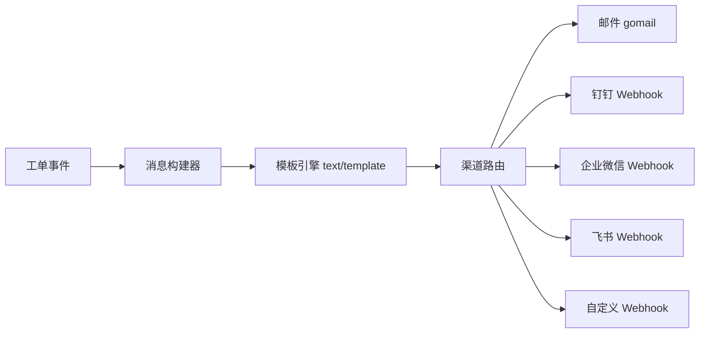

# 04 - 自定义消息推送

> **优先级**: P1 | **预估工期**: 5-7 天 | **依赖**: 无

## 一、需求背景

当前消息推送仅支持邮件和钉钉 Webhook 两种渠道，且模板硬编码在 Go 源码中。需要扩展支持企业微信、飞书等主流 IM 平台，并允许管理员自定义消息模板。

## 二、现状分析

### 2.1 推送架构

```
pusher/
├── types.go     StatusType 枚举, Msg/OrderTPL 结构体
├── pusher.go    NewMessagePusher -> .Order() -> .OrderBuild(status) -> .Push()
│                SendMail() 使用 gomail
│                硬编码 TmplMail / Tmpl2Mail HTML 模板
└── ding.go      PusherMessages() HTTP POST to Webhook
                 Commontext 硬编码 markdown 模板
                 Sign() HMAC-SHA256 签名
```

### 2.2 配置模型

```go
// subModel.go
type Message struct {
    WebHook  string  // 钉钉 Webhook URL
    Host     string  // SMTP Host
    Port     int     // SMTP Port
    User     string  // SMTP 发件人
    Password string  // SMTP 密码
    ToUser   string  // 测试收件人
    Mail     bool    // 启用邮件
    Ding     bool    // 启用钉钉
    Ssl      bool    // SMTP SSL
    PushType bool    // 推送类型
    Key      string  // 钉钉签名密钥
}
```

### 2.3 局限

- 渠道固定: 仅邮件 + 钉钉
- 模板硬编码: `TmplMail`, `Tmpl2Mail`, `Commontext` 为 Go 字符串常量
- 不支持模板变量自定义
- 不支持按事件类型配置不同模板

## 三、技术方案

### 3.1 架构设计



### 3.2 后端改动

#### 3.2.1 扩展 Message 配置

**文件**: `Yearning-next/src/model/subModel.go`

```go
type Message struct {
    // 邮件 (保留)
    Host     string `json:"host"`
    Port     int    `json:"port"`
    User     string `json:"user"`
    Password string `json:"password"`
    ToUser   string `json:"to_user"`
    Mail     bool   `json:"mail"`
    Ssl      bool   `json:"ssl"`

    // 钉钉 (保留)
    Ding     bool   `json:"ding"`
    WebHook  string `json:"web_hook"`
    Key      string `json:"key"`

    // 企业微信 (新增)
    Wechat     bool   `json:"wechat"`
    WechatHook string `json:"wechat_hook"`

    // 飞书 (新增)
    Feishu     bool   `json:"feishu"`
    FeishuHook string `json:"feishu_hook"`
    FeishuSecret string `json:"feishu_secret"`

    // 自定义 Webhook (新增)
    CustomWebhook     bool   `json:"custom_webhook"`
    CustomWebhookUrl  string `json:"custom_webhook_url"`
    CustomWebhookHeaders string `json:"custom_webhook_headers"` // JSON 格式

    // 模板 (新增)
    PushType    bool   `json:"push_type"`
    CustomTpl   string `json:"custom_tpl"`   // 自定义 IM 推送模板
    MailTpl     string `json:"mail_tpl"`     // 自定义邮件 HTML 模板
}
```

#### 3.2.2 模板引擎

**新增文件**: `Yearning-next/src/lib/pusher/template.go`

```go
package pusher

import (
    "bytes"
    "text/template"
)

type TemplateVars struct {
    WorkId   string
    Username string
    Source   string
    Status   string
    Domain   string
    Assigned string
    Text     string
    Date     string
}

var defaultIMTemplate = `## Yearning 工单{{.Status}}通知
**工单编号:** {{.WorkId}}
**数据源:** {{.Source}}
**工单说明:** {{.Text}}
**提交人员:** {{.Username}}
**下一步操作人:** {{.Assigned}}
**平台地址:** [{{.Domain}}]({{.Domain}})
**状态:** {{.Status}}`

var defaultMailTemplate = `<html><body>
<h1>Yearning 工单{{.Status}}通知</h1>
<p>工单号: {{.WorkId}}</p>
<p>发起人: {{.Username}}</p>
<p>数据源: {{.Source}}</p>
<p>地址: <a href="{{.Domain}}">{{.Domain}}</a></p>
<p>状态: {{.Status}}</p>
</body></html>`

func RenderTemplate(tplStr string, vars TemplateVars) (string, error) {
    if tplStr == "" {
        tplStr = defaultIMTemplate
    }
    tmpl, err := template.New("msg").Parse(tplStr)
    if err != nil {
        return "", err
    }
    var buf bytes.Buffer
    if err := tmpl.Execute(&buf, vars); err != nil {
        return "", err
    }
    return buf.String(), nil
}
```

#### 3.2.3 企业微信推送

**新增文件**: `Yearning-next/src/lib/pusher/wechat.go`

```go
package pusher

import (
    "Yearning-go/src/model"
    "encoding/json"
    "strings"
    "net/http"
)

type wechatMsg struct {
    Msgtype  string         `json:"msgtype"`
    Markdown wechatMarkdown `json:"markdown"`
}

type wechatMarkdown struct {
    Content string `json:"content"`
}

func PushWechat(msg model.Message, content string) {
    payload := wechatMsg{
        Msgtype:  "markdown",
        Markdown: wechatMarkdown{Content: content},
    }
    body, _ := json.Marshal(payload)
    req, _ := http.NewRequest("POST", msg.WechatHook,
        strings.NewReader(string(body)))
    req.Header.Set("Content-Type", "application/json")
    client := &http.Client{}
    resp, err := client.Do(req)
    if err != nil {
        model.DefaultLogger.Errorf("wechat push: %s", err.Error())
        return
    }
    defer resp.Body.Close()
}
```

#### 3.2.4 飞书推送

**新增文件**: `Yearning-next/src/lib/pusher/feishu.go`

```go
package pusher

import (
    "Yearning-go/src/model"
    "crypto/hmac"
    "crypto/sha256"
    "encoding/base64"
    "encoding/json"
    "fmt"
    "net/http"
    "strings"
    "time"
)

type feishuMsg struct {
    Timestamp string        `json:"timestamp,omitempty"`
    Sign      string        `json:"sign,omitempty"`
    MsgType   string        `json:"msg_type"`
    Content   feishuContent `json:"content"`
}

type feishuContent struct {
    Text string `json:"text"`
}

func feishuSign(secret string) (string, string) {
    timestamp := fmt.Sprintf("%d", time.Now().Unix())
    stringToSign := fmt.Sprintf("%s\n%s", timestamp, secret)
    h := hmac.New(sha256.New, []byte(stringToSign))
    return timestamp, base64.StdEncoding.EncodeToString(h.Sum(nil))
}

func PushFeishu(msg model.Message, content string) {
    payload := feishuMsg{
        MsgType: "text",
        Content: feishuContent{Text: content},
    }
    if msg.FeishuSecret != "" {
        payload.Timestamp, payload.Sign = feishuSign(msg.FeishuSecret)
    }
    body, _ := json.Marshal(payload)
    req, _ := http.NewRequest("POST", msg.FeishuHook,
        strings.NewReader(string(body)))
    req.Header.Set("Content-Type", "application/json")
    client := &http.Client{}
    resp, err := client.Do(req)
    if err != nil {
        model.DefaultLogger.Errorf("feishu push: %s", err.Error())
        return
    }
    defer resp.Body.Close()
}
```

#### 3.2.5 重构 Push() 方法

**文件**: `Yearning-next/src/lib/pusher/pusher.go`

```go
func (tpl *OrderTPL) Push() {
    vars := tpl.templateVars

    // 邮件
    if model.GloMessage.Mail {
        mailContent := tpl.mailTpl
        if model.GloMessage.MailTpl != "" {
            mailContent, _ = RenderTemplate(model.GloMessage.MailTpl, vars)
        }
        for _, i := range tpl.ll.ToUser {
            if i.Email != "" {
                go SendMail(i.Email, tpl.ll.Message, mailContent)
            }
        }
    }

    // 钉钉
    if model.GloMessage.Ding && model.GloMessage.WebHook != "" {
        content := tpl.pushTpl
        if model.GloMessage.CustomTpl != "" {
            content, _ = RenderTemplate(model.GloMessage.CustomTpl, vars)
            content = wrapDingMarkdown(content)
        }
        go PusherMessages(tpl.ll.Message, content)
    }

    // 企业微信 (新增)
    if model.GloMessage.Wechat && model.GloMessage.WechatHook != "" {
        content, _ := RenderTemplate(model.GloMessage.CustomTpl, vars)
        go PushWechat(tpl.ll.Message, content)
    }

    // 飞书 (新增)
    if model.GloMessage.Feishu && model.GloMessage.FeishuHook != "" {
        content, _ := RenderTemplate(model.GloMessage.CustomTpl, vars)
        go PushFeishu(tpl.ll.Message, content)
    }
}
```

#### 3.2.6 设置页接口

**文件**: `Yearning-next/src/handler/manage/settings/setting.go`

`SuperTestSetting` 增加测试分支:

```go
case "wechat":
    go pusher.PushWechat(u.Message, "Yearning 企业微信测试消息")
case "feishu":
    go pusher.PushFeishu(u.Message, "Yearning 飞书测试消息")
```

### 3.3 前端改动

#### 3.3.1 设置页

**文件**: `gemini-next-next/src/views/manager/setting/setting.vue`

新增 Tab 页或折叠面板:

```
消息推送配置
├── 邮件 (现有)
│   └── SMTP 配置 + 测试按钮
├── 钉钉 (现有)
│   └── Webhook + 签名密钥 + 测试按钮
├── 企业微信 (新增)
│   └── [启用开关] Webhook URL + 测试按钮
├── 飞书 (新增)
│   └── [启用开关] Webhook URL + 签名密钥 + 测试按钮
├── 自定义 Webhook (新增)
│   └── [启用开关] URL + 自定义 Headers
└── 消息模板 (新增)
    ├── IM 消息模板 (Monaco Editor)
    │   可用变量: {{.WorkId}} {{.Username}} {{.Source}}
    │            {{.Status}} {{.Domain}} {{.Assigned}} {{.Text}}
    ├── 邮件 HTML 模板 (Monaco Editor)
    └── [预览] [恢复默认]
```

## 四、数据库迁移

无需 DDL 变更。`Message` 存储在 `CoreGlobalConfiguration.message` JSON 字段中，新增的配置项自动序列化。

## 五、模板变量参考

| 变量 | 说明 | 示例 |
|------|------|------|
| `{{.WorkId}}` | 工单编号 | WK-20260422-001 |
| `{{.Username}}` | 提交人 | zhangsan |
| `{{.Source}}` | 数据源名称 | prod-mysql-01 |
| `{{.Status}}` | 工单状态 | 已提交 / 已同意 / 已驳回 |
| `{{.Domain}}` | 平台地址 | https://yearning.example.com |
| `{{.Assigned}}` | 当前审批人 | lisi, wangwu |
| `{{.Text}}` | 工单说明 | 用户表增加头像字段 |
| `{{.Date}}` | 提交时间 | 2026-04-22 10:30 |

## 六、测试要点

1. 各渠道独立启用/关闭测试
2. 自定义模板渲染: 变量替换正确性
3. 模板语法错误时的降级处理 (使用默认模板)
4. 企业微信/飞书 Webhook 签名验证
5. 测试发送功能 (每个渠道)
6. 并发推送: 同一事件触发多渠道不阻塞
