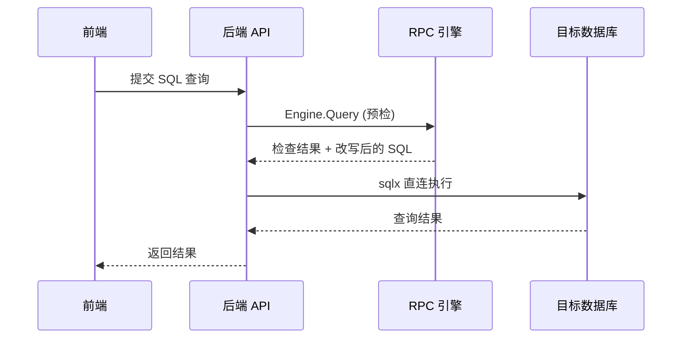
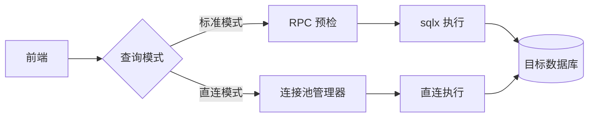

# 10 - C 端直连查询

> **优先级**: P3 | **预估工期**: 5-7 天 | **依赖**: 无

## 一、需求背景

当前查询通过 RPC 引擎预检 (`Engine.Query`) 后，再由后端 `sqlx` 连接目标库执行。RPC 预检在安全审计场景下很有价值，但对于日常开发查询是额外的延迟。需要支持"C 端直连"模式，跳过 RPC 预检，直接通过连接池连接目标库查询。

## 二、现状分析

### 2.1 当前查询流程



**关键代码** (`personal/impl.go`):

```go
func (q *QueryDeal) PreCheck(insulateWordList string) error {
    client := calls.NewRpc()
    client.Call("Engine.Query", &QueryArgs{SQL: q.Ref.Sql, ...}, &rs)
    // 预检通过后才执行
}
```

### 2.2 局限

- 每次查询都经过 RPC 预检，增加延迟
- RPC 引擎不可用时无法查询
- 对于只读查询，预检收益有限

## 三、技术方案

### 3.1 架构设计



直连模式保留:
- 权限校验 (用户是否有查询权限)
- 敏感词过滤 (insulate_word_list)
- 查询超时控制
- 审计日志记录

跳过:
- RPC 引擎的 SQL 预检和改写

### 3.2 后端改动

#### 3.2.1 连接池管理器

**新增文件**: `Yearning-next/src/lib/pool/pool.go`

```go
package pool

import (
    "Yearning-go/src/lib/enc"
    "Yearning-go/src/model"
    "fmt"
    "sync"
    "time"

    "github.com/cookieY/sqlx"
    _ "github.com/go-sql-driver/mysql"
)

type ConnPool struct {
    pools sync.Map // sourceId -> *poolEntry
}

type poolEntry struct {
    db       *sqlx.DB
    lastUsed time.Time
}

var Global = &ConnPool{}

func (p *ConnPool) Get(sourceId string) (*sqlx.DB, error) {
    if v, ok := p.pools.Load(sourceId); ok {
        entry := v.(*poolEntry)
        entry.lastUsed = time.Now()
        if err := entry.db.Ping(); err == nil {
            return entry.db, nil
        }
        // ping 失败, 重建连接
        entry.db.Close()
        p.pools.Delete(sourceId)
    }

    // 查询数据源配置
    var source model.CoreDataSource
    if err := model.DB().Where("source_id = ?", sourceId).
        First(&source).Error; err != nil {
        return nil, fmt.Errorf("数据源不存在: %s", sourceId)
    }

    dsn := fmt.Sprintf("%s:%s@tcp(%s:%d)/?charset=utf8mb4&parseTime=true",
        source.Username,
        enc.Decrypt(model.C.General.SecretKey, source.Password),
        source.IP, source.Port)

    db, err := sqlx.Open("mysql", dsn)
    if err != nil {
        return nil, err
    }

    db.SetMaxOpenConns(10)
    db.SetMaxIdleConns(5)
    db.SetConnMaxLifetime(10 * time.Minute)

    p.pools.Store(sourceId, &poolEntry{db: db, lastUsed: time.Now()})
    return db, nil
}

func (p *ConnPool) Close(sourceId string) {
    if v, ok := p.pools.LoadAndDelete(sourceId); ok {
        v.(*poolEntry).db.Close()
    }
}

// CleanIdle 清理超过 30 分钟未使用的连接
func (p *ConnPool) CleanIdle() {
    threshold := time.Now().Add(-30 * time.Minute)
    p.pools.Range(func(key, value interface{}) bool {
        entry := value.(*poolEntry)
        if entry.lastUsed.Before(threshold) {
            entry.db.Close()
            p.pools.Delete(key)
        }
        return true
    })
}
```

#### 3.2.2 数据源配置扩展

**文件**: `Yearning-next/src/model/modal.go`

`CoreDataSource` 新增:

```go
DirectConnect int `gorm:"type:tinyint(1);not null;default:0" json:"direct_connect"`
```

- 0: 不允许直连
- 1: 允许直连

#### 3.2.3 直连查询 Handler

**文件**: `Yearning-next/src/handler/personal/query.go` (或新文件)

```go
// POST /api/v2/query/direct
func DirectQuery(c yee.Context) error {
    req := new(QueryDeal)
    c.Bind(req)
    user := new(factory.Token).JwtParse(c)

    // 1. 权限校验
    if !hasQueryPermission(user.Username, req.Ref.SourceId) {
        return c.JSON(200, ERR("无查询权限"))
    }

    // 2. 检查数据源是否允许直连
    var source model.CoreDataSource
    model.DB().Where("source_id = ?", req.Ref.SourceId).First(&source)
    if source.DirectConnect != 1 {
        return c.JSON(200, ERR("该数据源未启用直连模式"))
    }

    // 3. 敏感词过滤 (保留安全校验)
    insulateWords := strings.Split(source.InsulateWordList, ",")
    if containsSensitive(req.Ref.Sql, insulateWords) {
        return c.JSON(200, ERR("SQL 包含敏感关键词"))
    }

    // 4. 仅允许 SELECT 查询
    if !isSelectOnly(req.Ref.Sql) {
        return c.JSON(200, ERR("直连模式仅支持 SELECT 查询"))
    }

    // 5. 从连接池获取连接
    db, err := pool.Global.Get(req.Ref.SourceId)
    if err != nil {
        return c.JSON(200, ERR(err))
    }

    // 6. 执行查询 (带超时)
    ctx, cancel := context.WithTimeout(context.Background(),
        time.Duration(model.GloOther.ExQueryTime)*time.Second)
    defer cancel()

    runner := &MultiSQLRunner{SQL: req.Ref.Sql, InsulateWordList: ...}
    result, err := runner.Run(db, req.Ref.Schema)
    if err != nil {
        return c.JSON(200, ERR(err))
    }

    // 7. 记录审计日志
    model.DB().Create(&model.CoreQueryRecord{
        WorkId: "direct-" + factory.GenWorkId(),
        SQL:    req.Ref.Sql,
        ExTime: ...,
        Time:   time.Now().Format("2006-01-02 15:04"),
        Source: source.Source,
        Schema: req.Ref.Schema,
    })

    return c.JSON(200, common.SuccessPayload(result))
}
```

#### 3.2.4 定时清理空闲连接

**文件**: `Yearning-next/src/service/cron.go`

```go
func cronCleanIdlePool() {
    crontab := cron.New()
    crontab.AddFunc("*/5 * * * *", func() {
        pool.Global.CleanIdle()
    })
    crontab.Start()
}
```

#### 3.2.5 路由注册

```go
r.POST("/query/direct", personal.DirectQuery)
```

### 3.3 前端改动

#### 3.3.1 查询页

**文件**: `gemini-next-next/src/views/query/query.vue`

- 数据源选择器旁增加模式切换: `[标准模式 | 直连模式]`
- 仅 `direct_connect=1` 的数据源显示直连切换
- 直连模式下显示提示: "直连模式跳过预检，仅支持 SELECT"

#### 3.3.2 数据源管理

**文件**: `gemini-next-next/src/views/manager/db/db.vue`

- 数据源编辑表单新增"允许直连查询"开关

#### 3.3.3 新增 API

```typescript
export const DirectQuery = (params: {
    source_id: string
    schema: string
    sql: string
}) => axios.post('/api/v2/query/direct', { ref: params })
```

## 四、数据库迁移

```sql
ALTER TABLE core_data_sources ADD COLUMN direct_connect TINYINT(1) DEFAULT 0;
```

## 五、安全措施

| 措施 | 说明 |
|------|------|
| 仅 SELECT | 直连模式只允许 SELECT 语句 |
| 权限校验 | 复用现有 QuerySource 权限体系 |
| 敏感词过滤 | 复用 insulate_word_list |
| 查询超时 | 使用 context 超时控制 (ExQueryTime 配置) |
| 结果集限制 | 复用 GloOther.Limit 行数限制 |
| 审计日志 | 所有直连查询记录到 CoreQueryRecord |
| 管理员控制 | 数据源级别的直连开关 |

## 六、测试要点

1. 直连查询返回结果与标准模式一致
2. 非 SELECT 语句被拒绝
3. 敏感词过滤正常工作
4. 查询超时正确触发
5. 连接池自动清理空闲连接
6. 数据源未启用直连时请求被拒绝
7. 并发查询的连接池性能
